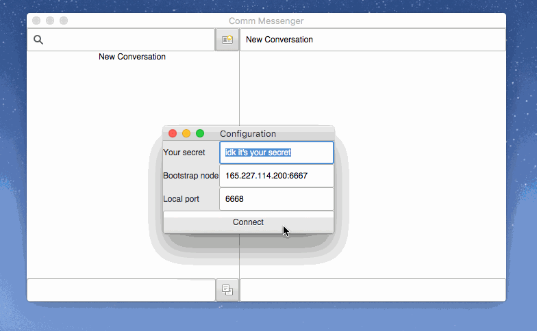
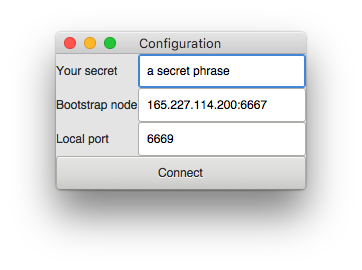

# comm-gtk

comm is a peer-to-peer instant messaging protocol designed to be resilient to
censorship. comm-gtk is a GUI client built on the [comm library][comm]. To try
it out, start the app. In the configuration window, enter a secret phrase, a
bootstrap node (`IP:port` pair), and a local port to listen on (e.g. 6669). For
a bootstrap node, try `165.227.114.200:6667` (or any other node's IP address if
you know one). Click connect to join the network.

Grab your address by clicking the copy button in the lower-left corner and
share it. Strike up conversation with a friend by putting their address in
the "New Conversation" input. Start new conversations by clicking the button
towards the upper-left corner.

This instant messaging network is likely to be a lonely place, but you can try
messaging me at my address:

    fe980ce10a89da42ddb0c2d5f35b5d2e2a10c65b

## Installation

Grab a build from GitHub, or if you want to build it yourself:

### MacOS

    make app

### Everyone else

    cargo build --release

And then, whatever you people do to run an executable. `cargo run` is also a
good bet.

## What in tarnation?

The gist of it is that everyone relays messages for everyone, with some
fanciness for delivery so as to not flood the network with traffic, to store
messages for participants until they can receive them, and to alert senders of
receipt. For a more detailed explanation, check out the [comm library][comm]
repo.

All of this is written in Rust.

## Why, though?

Writing weird code is my therapy.

## What next?

I have all kinds of ideas. Implement [libsignal][libsignal] for end-to-end
encryption, model threats and freeloaders, mitigate threats and freeloaders,
add more network transport mediums (it's not married to UDP), improve NAT
traversal. Sharing images? Idk. [Want to help?](mailto:zgstewart@gmail.com).

[comm]: https://github.com/zacstewart/comm
[libsignal]: https://github.com/signalapp/libsignal-protocol-c
